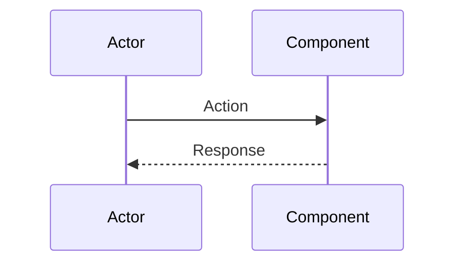

# Architecture Documentation Maintenance Guide

## Purpose

This guide ensures that PropChain's architecture documentation remains accurate, relevant, and valuable as the system evolves. Proper maintenance prevents documentation drift and preserves institutional knowledge.

---

## Table of Contents

1. [Documentation Ownership](#documentation-ownership)
2. [Update Triggers](#update-triggers)
3. [Review Schedule](#review-schedule)
4. [Change Management Process](#change-management-process)
5. [Version Control](#version-control)
6. [Quality Standards](#quality-standards)
7. [Common Pitfalls](#common-pitfalls)

---

## Documentation Ownership

### Roles & Responsibilities

#### Chief Architect
**Responsibilities**:
- Overall architecture documentation accuracy
- Quarterly review coordination
- ADR approval workflow
- Cross-document consistency

**Tasks**:
- Assign document owners for each major component
- Schedule and lead quarterly reviews
- Ensure alignment between code and documentation
- Approve major documentation changes

#### Document Owners
**Responsibilities**:
- Accuracy of specific documents
- Timely updates when systems change
- Incorporating community feedback
- Regular content audits

**Assigned Documents**:
```
SYSTEM_ARCHITECTURE_OVERVIEW.md → Lead System Architect
COMPONENT_INTERACTION_DIAGRAMS.md → Integration Team Lead
ARCHITECTURAL_PRINCIPLES.md → Chief Architect
contracts.md → Smart Contract Lead
deployment.md → DevOps Lead
adr/*.md → Proposal Authors
```

#### Contributors
**Responsibilities**:
- Report inaccuracies via issues
- Suggest improvements via PRs
- Update docs when implementing features
- Review proposed changes

---

## Update Triggers

### Mandatory Updates (Immediate)

Update documentation **within 48 hours** when:

1. **Security Incidents**
   - Vulnerability discovered in documented architecture
   - Security controls changed in response to incident
   - New attack vectors identified

2. **Production Deployments**
   - New contract deployed to mainnet
   - Contract implementation upgraded
   - Critical bug fix changes behavior

3. **Regulatory Changes**
   - New compliance requirements affect architecture
   - Jurisdiction support changes
   - Legal structure modifications

4. **Breaking Changes**
   - API interface changes
   - Data structure modifications
   - Protocol upgrade with incompatibilities

**Process**:
```
Code Change Merged → Create Doc Update Issue → 
Assign to Document Owner → Update Within 48 Hours → 
Review → Merge
```

---

### Scheduled Updates (Quarterly)

Review and update **every quarter**:

1. **System Architecture Overview**
   - Verify all components still exist
   - Check integration points are accurate
   - Update technology stack section
   - Review future considerations

2. **Component Interaction Diagrams**
   - Validate diagrams match current implementation
   - Add new interaction patterns
   - Remove deprecated flows
   - Update error handling scenarios

3. **Architectural Principles**
   - Review principles against current practices
   - Add new ADRs for major decisions
   - Update trade-off analysis based on learnings
   - Deprecate superseded decisions

4. **Architecture Decision Records**
   - Ensure all recent decisions documented
   - Update status of existing ADRs
   - Link related ADRs
   - Archive obsolete decisions

**Process**:
```
Quarter Start → Schedule Reviews → 
Document Owners Audit → Draft Updates → 
Team Review → Finalize → Publish
```

---

### Event-Driven Updates (As Needed)

Update when:

1. **Feature Development**
   - New feature adds architectural complexity
   - Feature changes existing component interactions
   - New integration points created

2. **Refactoring**
   - Component boundaries change
   - Data structures reorganized
   - Interface simplification

3. **Performance Optimization**
   - Caching strategies added
   - Gas optimization changes flow
   - Scalability solutions deployed

4. **Community Feedback**
   - GitHub issues reporting confusion
   - Developer questions reveal gaps
   - Audit recommendations

---

## Review Schedule

### Quarterly Review Cadence

**Week 1-2: Preparation**
```
Day 1-3: Document owners audit their docs
Day 4-7: Identify needed changes
Day 8-10: Create update proposals
```

**Week 3: Review Period**
```
Day 11-14: Community review of proposed changes
Day 15-17: Address feedback
Day 18: Final review by Chief Architect
```

**Week 4: Publication**
```
Day 19-20: Merge approved changes
Day 21: Announce updates
Day 22: Update documentation index
```

### Annual Deep Dive

Once per year, conduct comprehensive review:

**Objectives**:
- Complete architectural audit
- Validate all documentation against production
- Identify structural improvements
- Plan major documentation initiatives

**Participants**:
- Core development team
- Security auditors
- Community representatives
- Key stakeholders

**Output**:
- Architecture state of the union report
- Documentation roadmap for next year
- Technical debt assessment
- Improvement initiatives

---

## Change Management Process

### Minor Changes (< 10 lines)

**Process**:
1. Create PR with changes
2. Tag document owner as reviewer
3. Wait 24 hours for review
4. Merge if no objections

**Examples**:
- Typo corrections
- Clarification of existing content
- Adding examples
- Updating links

---

### Moderate Changes (10-50 lines)

**Process**:
1. Create GitHub issue describing changes
2. Allow 48-hour comment period
3. Create PR referencing issue
4. Document owner review required
5. 24-hour review period
6. Merge after approval

**Examples**:
- Adding new sections
- Updating diagrams
- Modifying examples
- Restructuring subsections

---

### Major Changes (> 50 lines or conceptual)

**Process**:
1. Create RFC (Request for Comments) issue
2. 1-week community discussion
3. Revise based on feedback
4. Create PR with final version
5. Chief Architect approval required
6. 48-hour final review
7. Merge and announce

**Examples**:
- New architectural patterns
- Significant restructuring
- New principle additions
- Paradigm shifts

---

### Emergency Changes

For urgent updates (security issues, critical errors):

**Process**:
1. Create PR marked `[EMERGENCY]`
2. Notify Chief Architect directly
3. Minimum 2 reviewer approvals
4. Merge immediately
5. Retrospective within 1 week

**Post-Mortem**:
- Why was emergency change needed?
- Could this have been prevented?
- What process improvements are needed?

---

## Version Control

### Git Strategy

**Branch Naming**:
```
docs/update-{document-name}-{date}
Example: docs/update-system-architecture-2024-01-15
```

**Commit Messages**:
```
docs({doc_name}): {change_description}

{detailed_explanation}

Related: #{issue_number}
```

**Example**:
```bash
git commit -m "docs(architecture): add cross-chain bridge section

Added detailed cross-chain bridge flow diagram and explanation 
in Section 3.2. Includes validator interaction sequence and 
security considerations.

Related: #234"
```

---

### Documentation Versioning

Use semantic versioning for documentation releases:

**MAJOR.MINOR.PATCH**

- **MAJOR**: Breaking conceptual changes
- **MINOR**: New sections, significant additions
- **PATCH**: Corrections, clarifications

**Tagging**:
```bash
git tag -a docs-v2.1.0 -m "Documentation Release v2.1.0"
git push origin docs-v2.1.0
```

**Release Notes**:
Create `docs/CHANGELOG.md` with each version:
```markdown
## [2.1.0] - 2024-01-15

### Added
- Cross-chain bridge interaction diagrams
- ZK-proof compliance section

### Changed
- Updated oracle integration examples
- Clarified gas optimization strategies

### Fixed
- Corrected property transfer flow diagram
- Fixed broken links in README
```

---

### Snapshot Archives

Maintain historical snapshots:

**Structure**:
```
docs/
├── archives/
│   ├── v1.0.0-2023-Q1/
│   ├── v1.5.0-2023-Q3/
│   └── v2.0.0-2024-Q1/
├── current/
│   ├── SYSTEM_ARCHITECTURE_OVERVIEW.md
│   └── ...
```

**Purpose**:
- Track evolution over time
- Enable reference to old versions
- Preserve superseded ADRs
- Historical research

---

## Quality Standards

### Documentation Checklist

Before publishing, verify:

**Content Quality**:
- [ ] Accurate against current implementation
- [ ] Clear and unambiguous language
- [ ] Appropriate technical depth
- [ ] No contradictory information
- [ ] Examples are tested and working

**Structure**:
- [ ] Logical organization
- [ ] Clear hierarchy and navigation
- [ ] Consistent formatting
- [ ] Appropriate use of diagrams
- [ ] Cross-references work correctly

**Accessibility**:
- [ ] Defined technical terms
- [ ] Included for different expertise levels
- [ ] Searchable and indexable
- [ ] Mobile-friendly formatting
- [ ] Alt text for diagrams

**Maintenance**:
- [ ] Last review date noted
- [ ] Document owner identified
- [ ] Next review scheduled
- [ ] Related documents linked
- [ ] Version number updated

---

### Diagram Standards

**Mermaid Diagram Guidelines**:

1. **Consistency**: Use standard shapes and colors
2. **Clarity**: Limit to 15 elements per diagram
3. **Labels**: Descriptive, concise labels
4. **Direction**: Top-to-bottom or left-to-right
5. **Legend**: Include legend for complex diagrams

**Example**:


**Diagram Review**:
- Can someone understand the flow without additional context?
- Are all participants clearly labeled?
- Is the diagram too complex (should split)?
- Does it match actual implementation?

---

### Writing Style Guide

**Tone**:
- Professional but approachable
- Confident but not dogmatic
- Inclusive and accessible
- Direct and concise

**Voice**:
- Active voice preferred
- Present tense for current architecture
- Past tense for historical decisions
- Future tense only for planned features

**Formatting**:
- Use **bold** for key terms on first use
- Use `code format` for technical references
- Use > blockquotes for important notes
- Use lists for multiple items

**Inclusive Language**:
- Avoid jargon when possible
- Define acronyms on first use
- Use clear, simple English
- Consider non-native speakers

---

## Common Pitfalls

### Documentation Drift

**Problem**: Documentation becomes outdated as code evolves.

**Symptoms**:
- Examples don't match current API
- Diagrams show removed components
- References to deprecated features
- Contradictory information across docs

**Prevention**:
- Link doc updates to code PRs
- Automated checks for broken links
- Quarterly audits mandatory
- Community reporting encouraged

**Remediation**:
```
Identify Drift → Create Issues → Prioritize → 
Assign Owners → Update → Verify
```

---

### Over-Documentation

**Problem**: Too much detail obscures important information.

**Symptoms**:
- Documents exceed 50 pages
- Multiple documents cover same topic
- Readers can't find key information
- High maintenance burden

**Prevention**:
- Apply 80/20 rule (document vital 20%)
- Separate conceptual from reference
- Use progressive disclosure
- Regular pruning

**Solution**:
```
Audit Content → Identify Redundancy → 
Consolidate/Simplify → Archive Excess → 
Reorganize
```

---

### Under-Documentation

**Problem**: Critical information not documented.

**Symptoms**:
- Repeated same questions from community
- Tribal knowledge dominates
- Onboarding takes too long
- Implementation varies from design

**Prevention**:
- Definition of Done includes docs
- New features require documentation
- Regular gap analysis
- User feedback incorporation

**Solution**:
```
Identify Gaps → Gather Knowledge → 
Draft Content → Review with Experts → 
Publish → Promote
```

---

### Diagram Decay

**Problem**: Diagrams become inaccurate as systems change.

**Symptoms**:
- Components in diagrams don't exist
- Missing new components
- Flows don't match implementation
- Legend inconsistent with diagram

**Prevention**:
- Store diagrams as code (Mermaid)
- Link diagrams to implementation
- Visual validation in reviews
- Auto-generation where possible

**Solution**:
```
Inventory Diagrams → Validate Each → 
Update or Remove → Establish Monitoring
```

---

### ADR Proliferation

**Problem**: Too many ADRs, important ones lost in noise.

**Symptoms**:
- 50+ ADRs and growing
- Contradictory decisions
- Superseded ADRs not marked
- Can't find key decisions

**Prevention**:
- Only document significant decisions
- Regular ADR consolidation
- Clear supersession chain
- Themed ADR series

**Solution**:
```
Categorize ADRs → Identify Key Decisions → 
Create Index → Archive Obsolete → 
Link Related
```

---

## Tools & Automation

### Documentation Tools

**Writing & Editing**:
- Markdown editors (VS Code, Obsidian)
- Grammar checking (Grammarly)
- Spell checking (cspell)
- Link checking (lychee)

**Diagram Creation**:
- Mermaid.js (embedded in Markdown)
- Draw.io (export to PNG + XML)
- Excalidraw (hand-drawn style)
- PlantUML (alternative to Mermaid)

**Validation**:
- Markdown linting (markdownlint)
- CI/CD integration (GitHub Actions)
- Broken link detection
- Accessibility checking

---

### Automation Scripts

**Weekly Checks**:
```bash
# Check for broken links
lychee docs/**/*.md

# Validate Mermaid diagrams
mmdc --validate docs/**/*.md

# Check markdown formatting
markdownlint docs/
```

**Monthly Reports**:
```bash
# Generate documentation metrics
python scripts/doc_metrics.py

# Identify stale documents
python scripts/find_stale_docs.py

# Export documentation health report
python scripts/doc_health_report.py
```

---

### CI/CD Integration

**GitHub Actions Workflow**:
```yaml
name: Documentation Validation

on:
  pull_request:
    paths:
      - 'docs/**'

jobs:
  validate:
    runs-on: ubuntu-latest
    steps:
      - uses: actions/checkout@v3
      
      - name: Check Links
        run: lychee docs/**/*.md
        
      - name: Lint Markdown
        run: markdownlint docs/
        
      - name: Validate Diagrams
        run: mmdc --validate docs/**/*.md
```

---

## Metrics & KPIs

### Documentation Health Metrics

**Quality Metrics**:
- **Accuracy Rate**: % of docs matching implementation
  - Target: >95%
  - Measurement: Quarterly audit
  
- **Completeness Score**: Coverage of key topics
  - Target: >90%
  - Measurement: Gap analysis checklist

- **Freshness Index**: Average age since last update
  - Target: <90 days
  - Measurement: Automated script

**Usage Metrics**:
- **Page Views**: Documentation traffic
  - Source: Analytics platform
  - Insight: Popular vs neglected docs

- **Search Queries**: What users look for
  - Source: Site search logs
  - Insight: Missing content identification

- **Time on Page**: Engagement indicator
  - Target: 2-5 minutes average
  - Insight: Comprehension difficulty

**Community Metrics**:
- **Issues Raised**: Documentation problems reported
  - Target: Increasing (good engagement)
  - Insight: Community involvement

- **PRs Submitted**: Community contributions
  - Target: Steady stream
  - Insight: Contribution barriers

- **Questions Asked**: Repeated questions
  - Target: Decreasing trend
  - Insight: Documentation effectiveness

---

## Continuous Improvement

### Feedback Loops

**User Feedback**:
- Feedback form at bottom of docs
- GitHub Discussions for questions
- Regular community surveys
- Office hours for doc help

**Team Feedback**:
- Retrospective input
- Onboarding experience surveys
- Developer experience reports
- Support ticket analysis

**Automated Feedback**:
- Search query analysis
- Heat maps of doc usage
- Drop-off points in reading
- A/B testing of explanations

---

### Improvement Initiatives

**Quarterly Projects**:
Each quarter, select 1-2 improvement projects:

Examples:
- Q1: Interactive tutorial integration
- Q2: Video walkthrough series
- Q3: Multi-language support
- Q4: AI-powered search

**Project Selection Criteria**:
- Impact on user understanding
- Effort required
- Maintenance burden
- Community demand

---

## Conclusion

Well-maintained architecture documentation is a living asset that grows with the project. By following this guide, PropChain ensures its documentation remains:

- **Accurate**: Reflects current implementation
- **Complete**: Covers all essential aspects
- **Accessible**: Easy to find and understand
- **Actionable**: Enables effective decision-making

**Remember**: Documentation is never done. It's an ongoing investment in project sustainability and community growth.

**Related Resources**:
- [System Architecture Overview](./SYSTEM_ARCHITECTURE_OVERVIEW.md)
- [Component Interaction Diagrams](./COMPONENT_INTERACTION_DIAGRAMS.md)
- [Architectural Principles](./ARCHITECTURAL_PRINCIPLES.md)
- [Contribution Guide](../CONTRIBUTING.md)

**Get Involved**:
- Report issues: GitHub Issues
- Suggest improvements: GitHub Discussions
- Contribute updates: Pull Requests
- Become a document owner: Contact Chief Architect
