# Component Interaction Diagrams

This document provides detailed visual representations of how PropChain components interact with each other across different use cases and scenarios.

## Table of Contents

1. [Core Property Lifecycle](#core-property-lifecycle)
2. [Trading & Transfer Operations](#trading--transfer-operations)
3. [Compliance & Verification](#compliance--verification)
4. [Cross-Chain Operations](#cross-chain-operations)
5. [Insurance & Risk Management](#insurance--risk-management)
6. [Oracle & Valuation](#oracle--valuation)
7. [Governance & Administration](#governance--administration)
8. [Error Handling & Edge Cases](#error-handling--edge-cases)

---

## Core Property Lifecycle

### 1. Property Registration Sequence

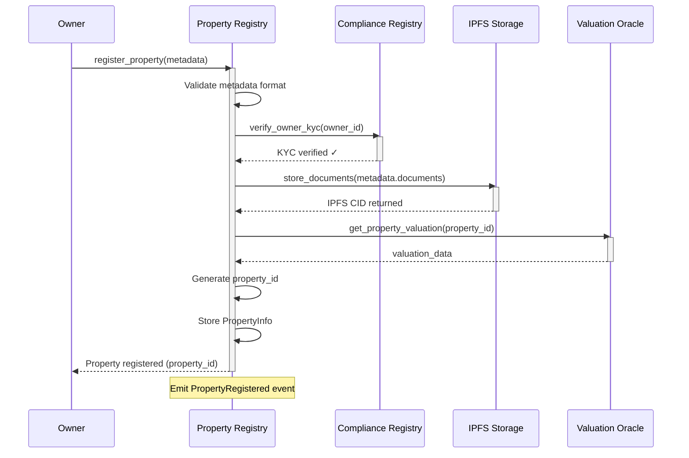
```mermaid
sequenceDiagram
    participant Owner
    participant Registry as Property Registry
    participant Compliance as Compliance Registry
    participant IPFS as IPFS Storage
    participant Oracle as Valuation Oracle

    Owner->>Registry: register_property(metadata)
    activate Registry
    
    Registry->>Registry: Validate metadata format
    Registry->>Compliance: verify_owner_kyc(owner_id)
    activate Compliance
    Compliance-->>Registry: KYC verified ✓
    deactivate Compliance
    
    Registry->>IPFS: store_documents(metadata.documents)
    activate IPFS
    IPFS-->>Registry: IPFS CID returned
    deactivate IPFS
    
    Registry->>Oracle: get_property_valuation(property_id)
    activate Oracle
    Oracle-->>Registry: valuation_data
    deactivate Oracle
    
    Registry->>Registry: Generate property_id
    Registry->>Registry: Store PropertyInfo
    
    Registry-->>Owner: Property registered (property_id)
    deactivate Registry
    
    Note over Registry: Emit PropertyRegistered event
```

### 2. Property Update Flow

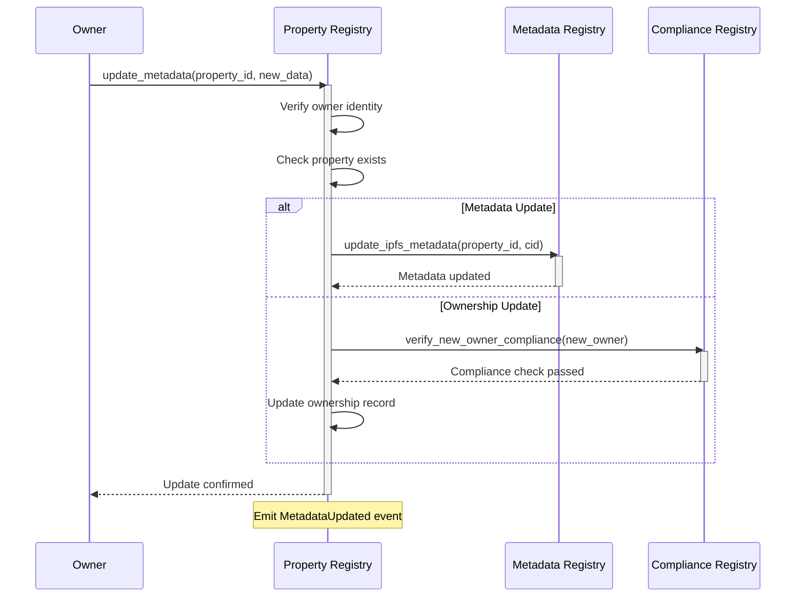
```mermaid
sequenceDiagram
    participant Owner
    participant Registry as Property Registry
    participant Metadata as Metadata Registry
    participant Compliance as Compliance Registry

    Owner->>Registry: update_metadata(property_id, new_data)
    activate Registry
    
    Registry->>Registry: Verify owner identity
    Registry->>Registry: Check property exists
    
    alt Metadata Update
        Registry->>Metadata: update_ipfs_metadata(property_id, cid)
        activate Metadata
        Metadata-->>Registry: Metadata updated
        deactivate Metadata
    else Ownership Update
        Registry->>Compliance: verify_new_owner_compliance(new_owner)
        activate Compliance
        Compliance-->>Registry: Compliance check passed
        deactivate Compliance
        Registry->>Registry: Update ownership record
    end
    
    Registry-->>Owner: Update confirmed
    deactivate Registry
    
    Note over Registry: Emit MetadataUpdated event
```

---

## Trading & Transfer Operations

### 3. Escrow Creation & Funding

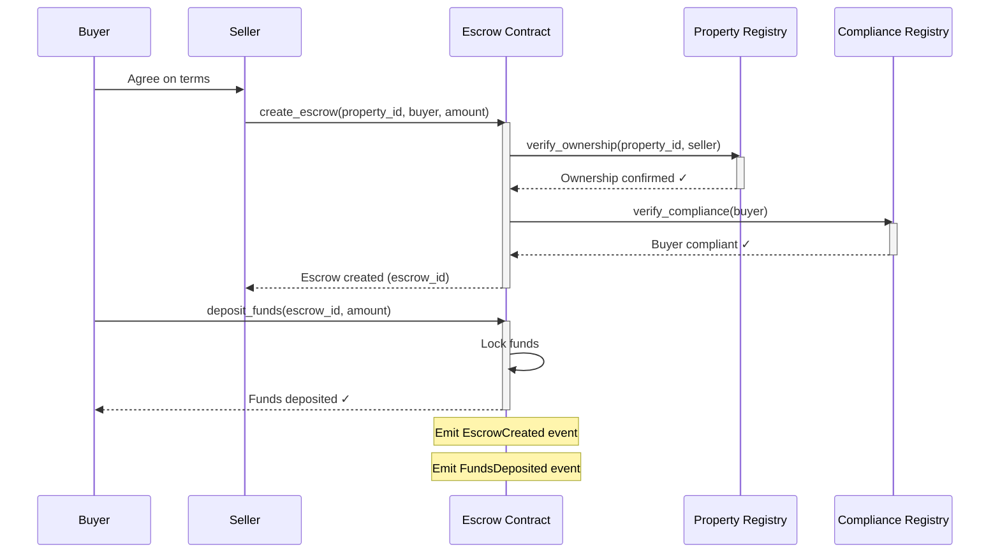
```mermaid
sequenceDiagram
    participant Buyer
    participant Seller
    participant Escrow as Escrow Contract
    participant Registry as Property Registry
    participant Compliance as Compliance Registry

    Buyer->>Seller: Agree on terms
    Seller->>Escrow: create_escrow(property_id, buyer, amount)
    activate Escrow
    
    Escrow->>Registry: verify_ownership(property_id, seller)
    activate Registry
    Registry-->>Escrow: Ownership confirmed ✓
    deactivate Registry
    
    Escrow->>Compliance: verify_compliance(buyer)
    activate Compliance
    Compliance-->>Escrow: Buyer compliant ✓
    deactivate Compliance
    
    Escrow-->>Seller: Escrow created (escrow_id)
    deactivate Escrow
    
    Buyer->>Escrow: deposit_funds(escrow_id, amount)
    activate Escrow
    Escrow->>Escrow: Lock funds
    Escrow-->>Buyer: Funds deposited ✓
    deactivate Escrow
    
    Note over Escrow: Emit EscrowCreated event
    Note over Escrow: Emit FundsDeposited event
```

### 4. Escrow Release & Property Transfer

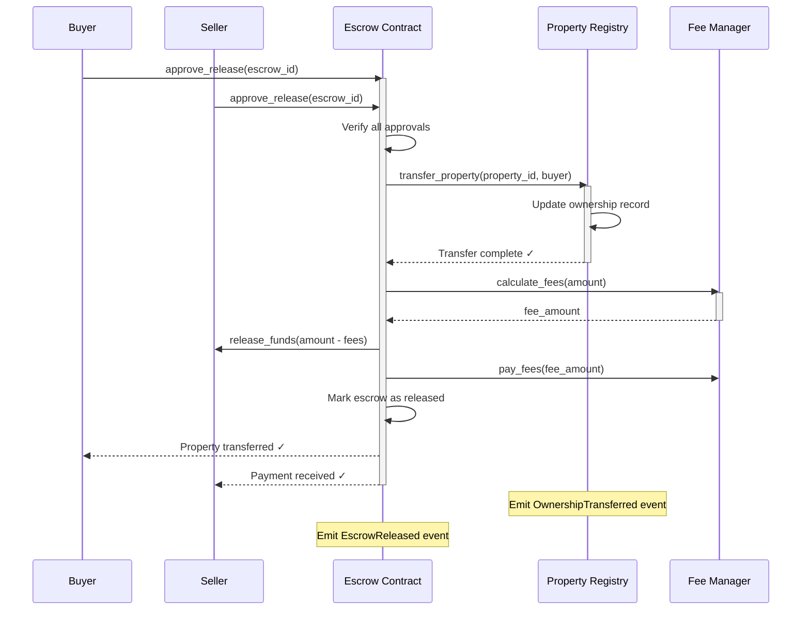
```mermaid
sequenceDiagram
    participant Buyer
    participant Seller
    participant Escrow as Escrow Contract
    participant Registry as Property Registry
    participant Fees as Fee Manager

    Buyer->>Escrow: approve_release(escrow_id)
    activate Escrow
    Seller->>Escrow: approve_release(escrow_id)
    
    Escrow->>Escrow: Verify all approvals
    Escrow->>Registry: transfer_property(property_id, buyer)
    activate Registry
    Registry->>Registry: Update ownership record
    Registry-->>Escrow: Transfer complete ✓
    deactivate Registry
    
    Escrow->>Fees: calculate_fees(amount)
    activate Fees
    Fees-->>Escrow: fee_amount
    deactivate Fees
    
    Escrow->>Seller: release_funds(amount - fees)
    Escrow->>Fees: pay_fees(fee_amount)
    
    Escrow->>Escrow: Mark escrow as released
    Escrow-->>Buyer: Property transferred ✓
    Escrow-->>Seller: Payment received ✓
    deactivate Escrow
    
    Note over Registry: Emit OwnershipTransferred event
    Note over Escrow: Emit EscrowReleased event
```

### 5. Dispute Resolution Flow

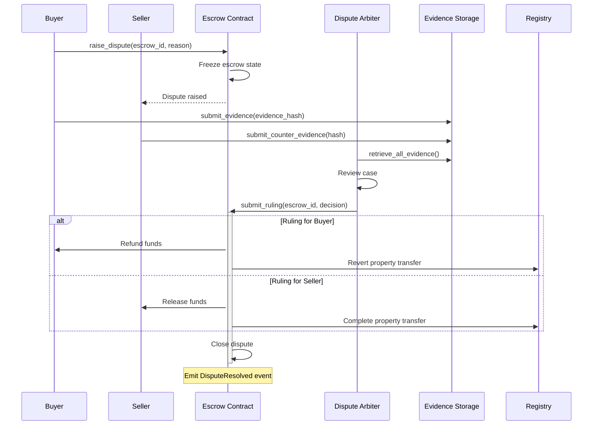
```mermaid
sequenceDiagram
    participant Buyer
    participant Seller
    participant Escrow as Escrow Contract
    participant Arbiter as Dispute Arbiter
    participant Evidence as Evidence Storage

    Buyer->>Escrow: raise_dispute(escrow_id, reason)
    activate Escrow
    Escrow->>Escrow: Freeze escrow state
    Escrow-->>Seller: Dispute raised
    
    Buyer->>Evidence: submit_evidence(evidence_hash)
    Seller->>Evidence: submit_counter_evidence(hash)
    
    Arbiter->>Evidence: retrieve_all_evidence()
    Arbiter->>Arbiter: Review case
    
    Arbiter->>Escrow: submit_ruling(escrow_id, decision)
    activate Escrow
    
    alt Ruling for Buyer
        Escrow->>Buyer: Refund funds
        Escrow->>Registry: Revert property transfer
    else Ruling for Seller
        Escrow->>Seller: Release funds
        Escrow->>Registry: Complete property transfer
    end
    
    Escrow->>Escrow: Close dispute
    deactivate Escrow
    
    Note over Escrow: Emit DisputeResolved event
```

---

## Compliance & Verification

### 6. User KYC/AML Verification

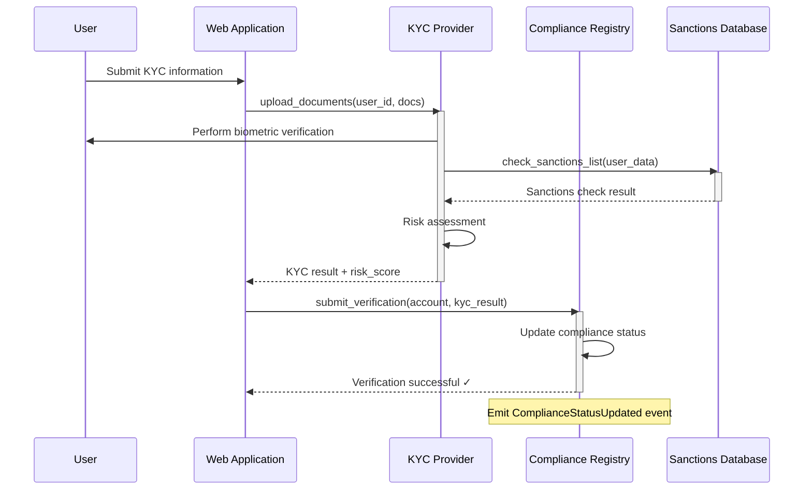
```mermaid
sequenceDiagram
    participant User
    participant Frontend as Web Application
    participant KYC_ProV as KYC Provider
    participant Compliance as Compliance Registry
    participant Sanctions as Sanctions Database

    User->>Frontend: Submit KYC information
    Frontend->>KYC_ProV: upload_documents(user_id, docs)
    activate KYC_ProV
    
    KYC_ProV->>User: Perform biometric verification
    KYC_ProV->>Sanctions: check_sanctions_list(user_data)
    activate Sanctions
    Sanctions-->>KYC_ProV: Sanctions check result
    deactivate Sanctions
    
    KYC_ProV->>KYC_ProV: Risk assessment
    KYC_ProV-->>Frontend: KYC result + risk_score
    deactivate KYC_ProV
    
    Frontend->>Compliance: submit_verification(account, kyc_result)
    activate Compliance
    Compliance->>Compliance: Update compliance status
    Compliance-->>Frontend: Verification successful ✓
    deactivate Compliance
    
    Note over Compliance: Emit ComplianceStatusUpdated event
```

### 7. Jurisdiction-Specific Compliance

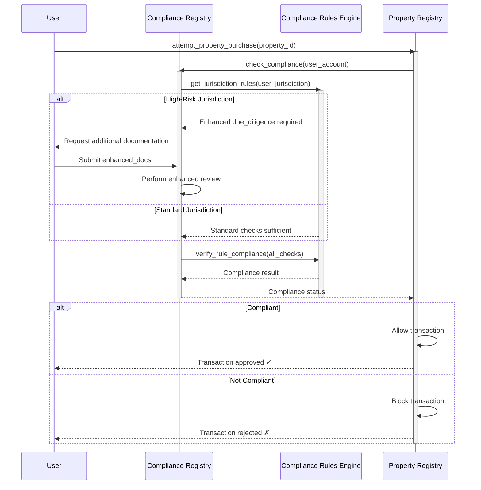
```mermaid
sequenceDiagram
    participant User
    participant Compliance as Compliance Registry
    participant Rules as Compliance Rules Engine
    participant Registry as Property Registry

    User->>Registry: attempt_property_purchase(property_id)
    activate Registry
    
    Registry->>Compliance: check_compliance(user_account)
    activate Compliance
    
    Compliance->>Rules: get_jurisdiction_rules(user_jurisdiction)
    activate Rules
    
    alt High-Risk Jurisdiction
        Rules-->>Compliance: Enhanced due_diligence required
        Compliance->>User: Request additional documentation
        User->>Compliance: Submit enhanced_docs
        Compliance->>Compliance: Perform enhanced review
    else Standard Jurisdiction
        Rules-->>Compliance: Standard checks sufficient
    end
    
    Compliance->>Rules: verify_rule_compliance(all_checks)
    Rules-->>Compliance: Compliance result
    
    Compliance-->>Registry: Compliance status
    deactivate Rules
    deactivate Compliance
    
    alt Compliant
        Registry->>Registry: Allow transaction
        Registry-->>User: Transaction approved ✓
    else Not Compliant
        Registry->>Registry: Block transaction
        Registry-->>User: Transaction rejected ✗
    end
    deactivate Registry
```

---

## Cross-Chain Operations

### 8. Bridge Token Transfer (Source Chain)

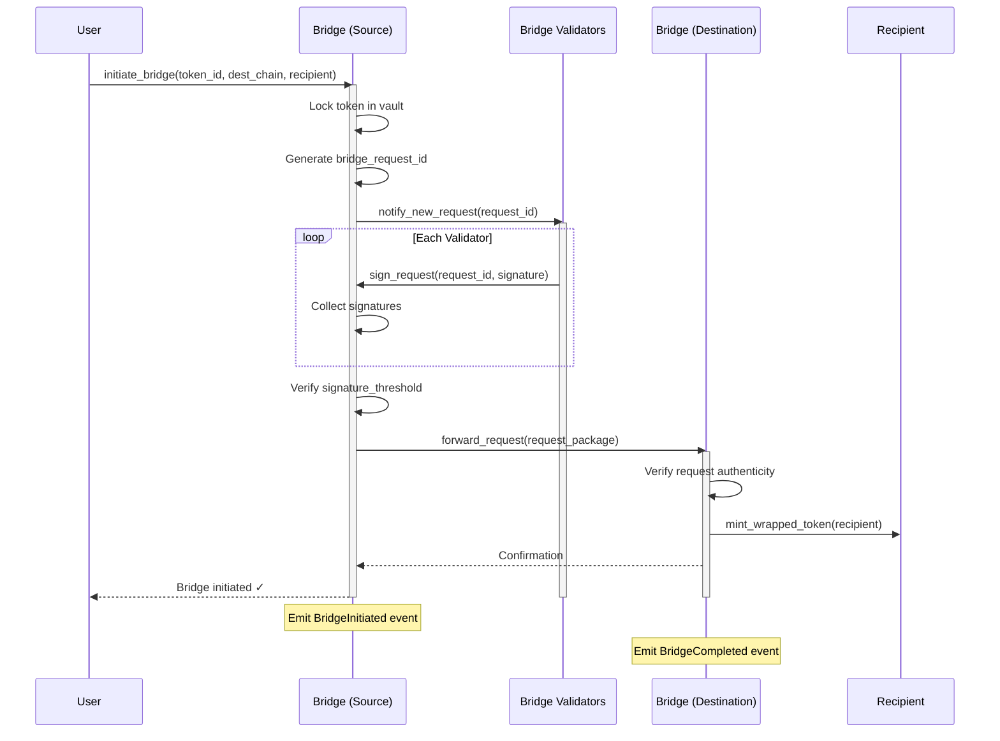
```mermaid
sequenceDiagram
    participant User
    participant SourceBridge as Bridge (Source)
    participant Validators as Bridge Validators
    participant DestBridge as Bridge (Destination)
    participant Recipient

    User->>SourceBridge: initiate_bridge(token_id, dest_chain, recipient)
    activate SourceBridge
    
    SourceBridge->>SourceBridge: Lock token in vault
    SourceBridge->>SourceBridge: Generate bridge_request_id
    
    SourceBridge->>Validators: notify_new_request(request_id)
    activate Validators
    
    loop Each Validator
        Validators->>SourceBridge: sign_request(request_id, signature)
        SourceBridge->>SourceBridge: Collect signatures
    end
    
    SourceBridge->>SourceBridge: Verify signature_threshold
    SourceBridge->>DestBridge: forward_request(request_package)
    activate DestBridge
    
    DestBridge->>DestBridge: Verify request authenticity
    DestBridge->>Recipient: mint_wrapped_token(recipient)
    DestBridge-->>SourceBridge: Confirmation
    
    SourceBridge-->>User: Bridge initiated ✓
    deactivate SourceBridge
    deactivate Validators
    deactivate DestBridge
    
    Note over SourceBridge: Emit BridgeInitiated event
    Note over DestBridge: Emit BridgeCompleted event
```

### 9. Cross-Chain Message Passing

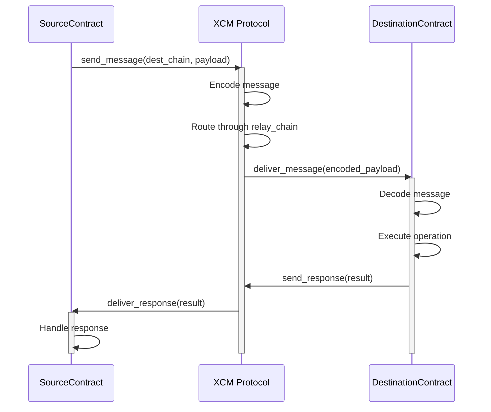
```mermaid
sequenceDiagram
    participant SourceContract
    participant XCM as XCM Protocol
    participant DestinationContract

    SourceContract->>XCM: send_message(dest_chain, payload)
    activate XCM
    
    XCM->>XCM: Encode message
    XCM->>XCM: Route through relay_chain
    
    XCM->>DestinationContract: deliver_message(encoded_payload)
    activate DestinationContract
    
    DestinationContract->>DestinationContract: Decode message
    DestinationContract->>DestinationContract: Execute operation
    
    DestinationContract->>XCM: send_response(result)
    XCM->>SourceContract: deliver_response(result)
    activate SourceContract
    
    SourceContract->>SourceContract: Handle response
    deactivate SourceContract
    deactivate XCM
    deactivate DestinationContract
```

---

## Insurance & Risk Management

### 10. Insurance Policy Creation

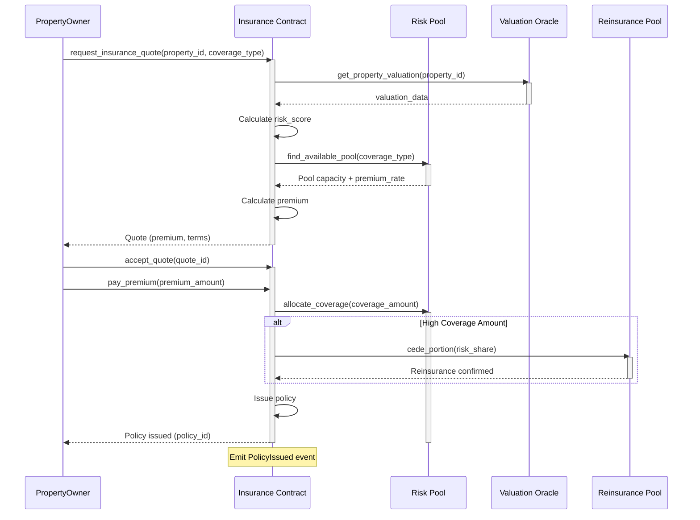
```mermaid
sequenceDiagram
    participant PropertyOwner
    participant Insurance as Insurance Contract
    participant Pool as Risk Pool
    participant Oracle as Valuation Oracle
    participant Reinsurance as Reinsurance Pool

    PropertyOwner->>Insurance: request_insurance_quote(property_id, coverage_type)
    activate Insurance
    
    Insurance->>Oracle: get_property_valuation(property_id)
    activate Oracle
    Oracle-->>Insurance: valuation_data
    deactivate Oracle
    
    Insurance->>Insurance: Calculate risk_score
    Insurance->>Pool: find_available_pool(coverage_type)
    activate Pool
    Pool-->>Insurance: Pool capacity + premium_rate
    deactivate Pool
    
    Insurance->>Insurance: Calculate premium
    Insurance-->>PropertyOwner: Quote (premium, terms)
    deactivate Insurance
    
    PropertyOwner->>Insurance: accept_quote(quote_id)
    activate Insurance
    PropertyOwner->>Insurance: pay_premium(premium_amount)
    
    Insurance->>Pool: allocate_coverage(coverage_amount)
    activate Pool
    
    alt High Coverage Amount
        Insurance->>Reinsurance: cede_portion(risk_share)
        activate Reinsurance
        Reinsurance-->>Insurance: Reinsurance confirmed
        deactivate Reinsurance
    end
    
    Insurance->>Insurance: Issue policy
    Insurance-->>PropertyOwner: Policy issued (policy_id)
    deactivate Insurance
    deactivate Pool
    
    Note over Insurance: Emit PolicyIssued event
```

### 11. Insurance Claim Processing

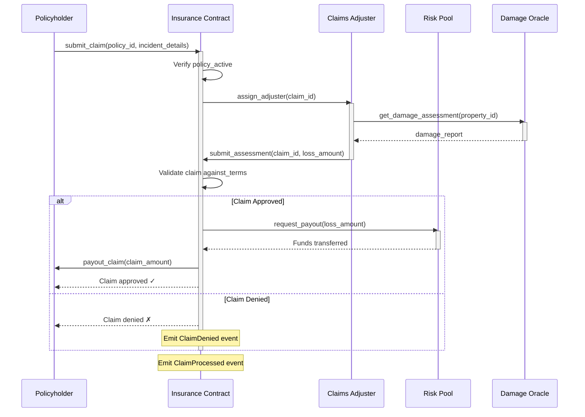
```mermaid
sequenceDiagram
    participant Policyholder
    participant Insurance as Insurance Contract
    participant ClaimsAdjuster as Claims Adjuster
    participant Pool as Risk Pool
    participant Oracle as Damage Oracle

    Policyholder->>Insurance: submit_claim(policy_id, incident_details)
    activate Insurance
    
    Insurance->>Insurance: Verify policy_active
    Insurance->>ClaimsAdjuster: assign_adjuster(claim_id)
    activate ClaimsAdjuster
    
    ClaimsAdjuster->>Oracle: get_damage_assessment(property_id)
    activate Oracle
    Oracle-->>ClaimsAdjuster: damage_report
    deactivate Oracle
    
    ClaimsAdjuster->>Insurance: submit_assessment(claim_id, loss_amount)
    deactivate ClaimsAdjuster
    
    Insurance->>Insurance: Validate claim against_terms
    
    alt Claim Approved
        Insurance->>Pool: request_payout(loss_amount)
        activate Pool
        Pool-->>Insurance: Funds transferred
        deactivate Pool
        Insurance->>Policyholder: payout_claim(claim_amount)
        Insurance-->>Policyholder: Claim approved ✓
    else Claim Denied
        Insurance-->>Policyholder: Claim denied ✗
        Note over Insurance: Emit ClaimDenied event
    end
    
    deactivate Insurance
    
    Note over Insurance: Emit ClaimProcessed event
```

---

## Oracle & Valuation

### 12. Multi-Source Price Aggregation

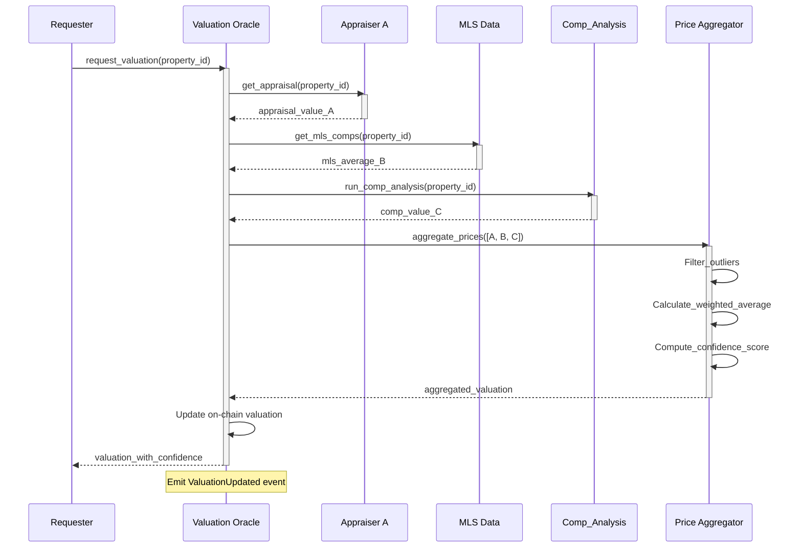
```mermaid
sequenceDiagram
    participant Requester
    participant Oracle as Valuation Oracle
    participant Source1 as Appraiser A
    participant Source2 as MLS Data
    participant Source3 as Comp_Analysis
    participant Aggregator as Price Aggregator

    Requester->>Oracle: request_valuation(property_id)
    activate Oracle
    
    Oracle->>Source1: get_appraisal(property_id)
    activate Source1
    Source1-->>Oracle: appraisal_value_A
    deactivate Source1
    
    Oracle->>Source2: get_mls_comps(property_id)
    activate Source2
    Source2-->>Oracle: mls_average_B
    deactivate Source2
    
    Oracle->>Source3: run_comp_analysis(property_id)
    activate Source3
    Source3-->>Oracle: comp_value_C
    deactivate Source3
    
    Oracle->>Aggregator: aggregate_prices([A, B, C])
    activate Aggregator
    Aggregator->>Aggregator: Filter_outliers
    Aggregator->>Aggregator: Calculate_weighted_average
    Aggregator->>Aggregator: Compute_confidence_score
    Aggregator-->>Oracle: aggregated_valuation
    deactivate Aggregator
    
    Oracle->>Oracle: Update on-chain valuation
    Oracle-->>Requester: valuation_with_confidence
    deactivate Oracle
    
    Note over Oracle: Emit ValuationUpdated event
```

### 13. Oracle Manipulation Detection

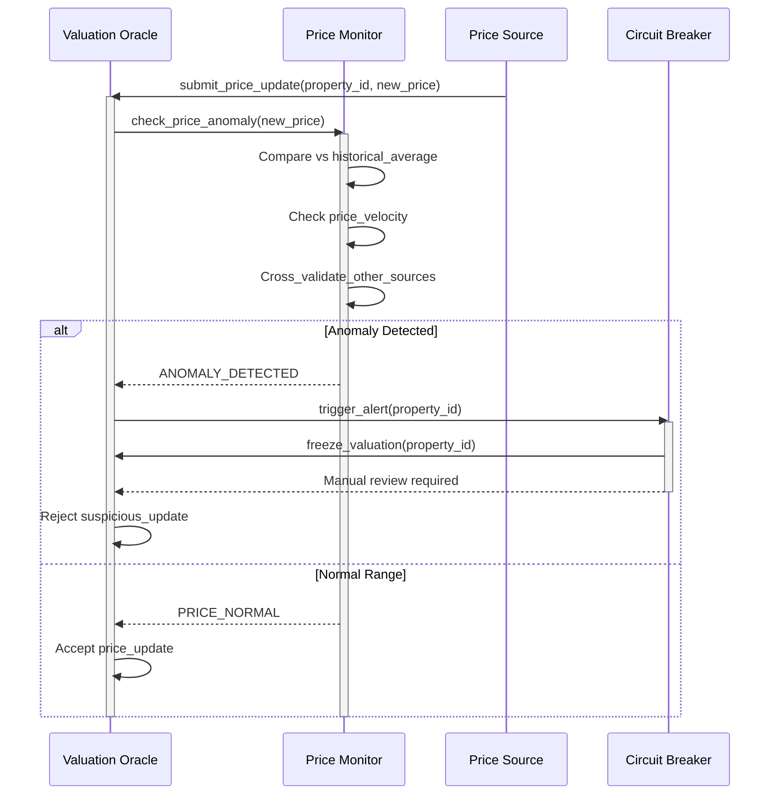
```mermaid
sequenceDiagram
    participant Oracle as Valuation Oracle
    participant Monitor as Price Monitor
    participant Source as Price Source
    participant CircuitBreaker as Circuit Breaker

    Source->>Oracle: submit_price_update(property_id, new_price)
    activate Oracle
    
    Oracle->>Monitor: check_price_anomaly(new_price)
    activate Monitor
    
    Monitor->>Monitor: Compare vs historical_average
    Monitor->>Monitor: Check price_velocity
    Monitor->>Monitor: Cross_validate_other_sources
    
    alt Anomaly Detected
        Monitor-->>Oracle: ANOMALY_DETECTED
        Oracle->>CircuitBreaker: trigger_alert(property_id)
        activate CircuitBreaker
        CircuitBreaker->>Oracle: freeze_valuation(property_id)
        CircuitBreaker-->>Oracle: Manual review required
        deactivate CircuitBreaker
        Oracle->>Oracle: Reject suspicious_update
    else Normal Range
        Monitor-->>Oracle: PRICE_NORMAL
        Oracle->>Oracle: Accept price_update
    end
    
    deactivate Monitor
    deactivate Oracle
```

---

## Governance & Administration

### 14. Protocol Upgrade Proposal

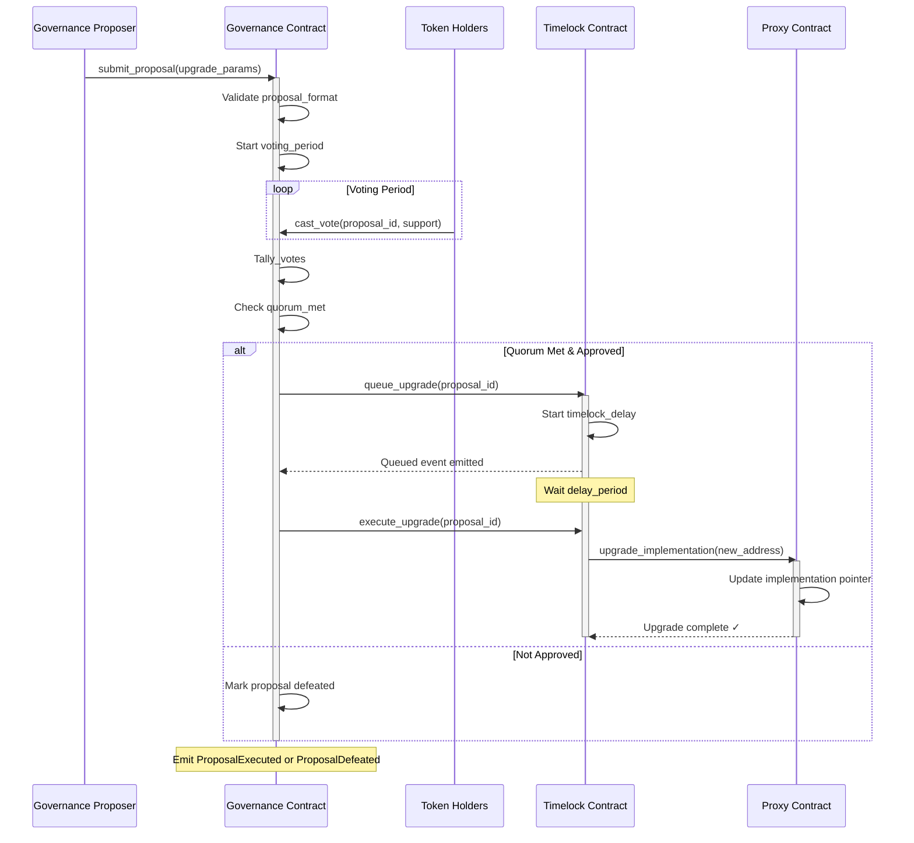
```mermaid
sequenceDiagram
    participant Proposer as Governance Proposer
    participant Gov as Governance Contract
    participant Voters as Token Holders
    participant Timelock as Timelock Contract
    participant Proxy as Proxy Contract

    Proposer->>Gov: submit_proposal(upgrade_params)
    activate Gov
    
    Gov->>Gov: Validate proposal_format
    Gov->>Gov: Start voting_period
    
    loop Voting Period
        Voters->>Gov: cast_vote(proposal_id, support)
    end
    
    Gov->>Gov: Tally_votes
    Gov->>Gov: Check quorum_met
    
    alt Quorum Met & Approved
        Gov->>Timelock: queue_upgrade(proposal_id)
        activate Timelock
        Timelock->>Timelock: Start timelock_delay
        Timelock-->>Gov: Queued event emitted
        
        Note over Timelock: Wait delay_period
        
        Gov->>Timelock: execute_upgrade(proposal_id)
        Timelock->>Proxy: upgrade_implementation(new_address)
        activate Proxy
        Proxy->>Proxy: Update implementation pointer
        Proxy-->>Timelock: Upgrade complete ✓
        deactivate Proxy
        deactivate Timelock
    else Not Approved
        Gov->>Gov: Mark proposal defeated
    end
    
    deactivate Gov
    
    Note over Gov: Emit ProposalExecuted or ProposalDefeated
```

### 15. Emergency Pause Mechanism

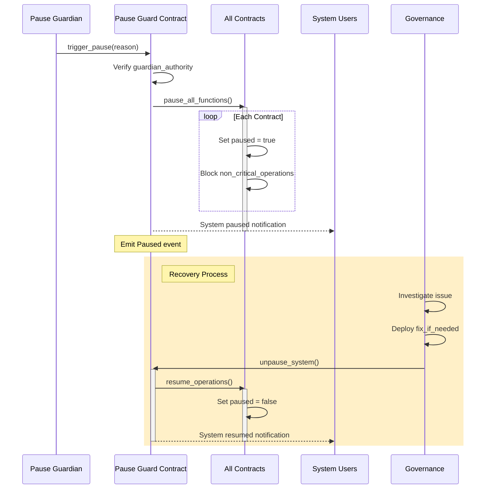
```mermaid
sequenceDiagram
    participant Guardian as Pause Guardian
    participant PauseGuard as Pause Guard Contract
    participant Contracts as All Contracts
    participant Users as System Users
    participant Gov as Governance

    Guardian->>PauseGuard: trigger_pause(reason)
    activate PauseGuard
    
    PauseGuard->>PauseGuard: Verify guardian_authority
    PauseGuard->>Contracts: pause_all_functions()
    activate Contracts
    
    loop Each Contract
        Contracts->>Contracts: Set paused = true
        Contracts->>Contracts: Block non_critical_operations
    end
    
    PauseGuard-->>Users: System paused notification
    deactivate Contracts
    
    Note over PauseGuard: Emit Paused event
    
    rect rgb(255, 240, 200)
        note right of PauseGuard: Recovery Process
        Gov->>Gov: Investigate issue
        Gov->>Gov: Deploy fix_if_needed
        Gov->>PauseGuard: unpause_system()
        activate PauseGuard
        PauseGuard->>Contracts: resume_operations()
        activate Contracts
        Contracts->>Contracts: Set paused = false
        PauseGuard-->>Users: System resumed notification
        deactivate Contracts
        deactivate PauseGuard
    end
```

---

## Error Handling & Edge Cases

### 16. Failed Transaction Rollback

```mermaid
sequenceDiagram
    participant User
    participant Registry as Property Registry
    participant Compliance as Compliance Registry
    participant ErrorHandler as Error Handler

    User->>Registry: transfer_property(to, token_id)
    activate Registry
    
    Registry->>Registry: Begin transaction
    
    Registry->>Compliance: verify_recipient(to)
    activate Compliance
    
    alt Compliance Check Fails
        Compliance-->>Registry: NOT_COMPLIANT
        deactivate Compliance
        
        Registry->>ErrorHandler: handle_error(COMPLIANCE_FAILED)
        activate ErrorHandler
        ErrorHandler->>ErrorHandler: Log error_details
        ErrorHandler->>Registry: rollback_transaction()
        Registry->>Registry: Revert all_state_changes
        Registry-->>User: Transaction reverted ✗
        deactivate ErrorHandler
    else Compliance Passes
        Compliance-->>Registry: COMPLIANT
        deactivate Compliance
        Registry->>Registry: Complete transfer
        Registry-->>User: Success ✓
    end
    
    deactivate Registry
```

### 17. Insufficient Gas Handling

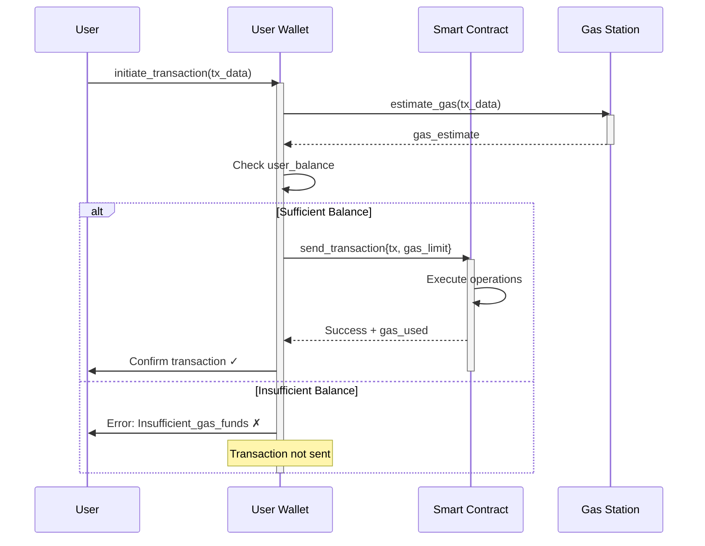
```mermaid
sequenceDiagram
    participant User
    participant Wallet as User Wallet
    participant Contract as Smart Contract
    participant GasStation as Gas Station

    User->>Wallet: initiate_transaction(tx_data)
    activate Wallet
    
    Wallet->>GasStation: estimate_gas(tx_data)
    activate GasStation
    GasStation-->>Wallet: gas_estimate
    deactivate GasStation
    
    Wallet->>Wallet: Check user_balance
    
    alt Sufficient Balance
        Wallet->>Contract: send_transaction{tx, gas_limit}
        activate Contract
        Contract->>Contract: Execute operations
        Contract-->>Wallet: Success + gas_used
        Wallet->>User: Confirm transaction ✓
        deactivate Contract
    else Insufficient Balance
        Wallet->>User: Error: Insufficient_gas_funds ✗
        Note over Wallet: Transaction not sent
    end
    
    deactivate Wallet
```

### 18. Oracle Data Staleness

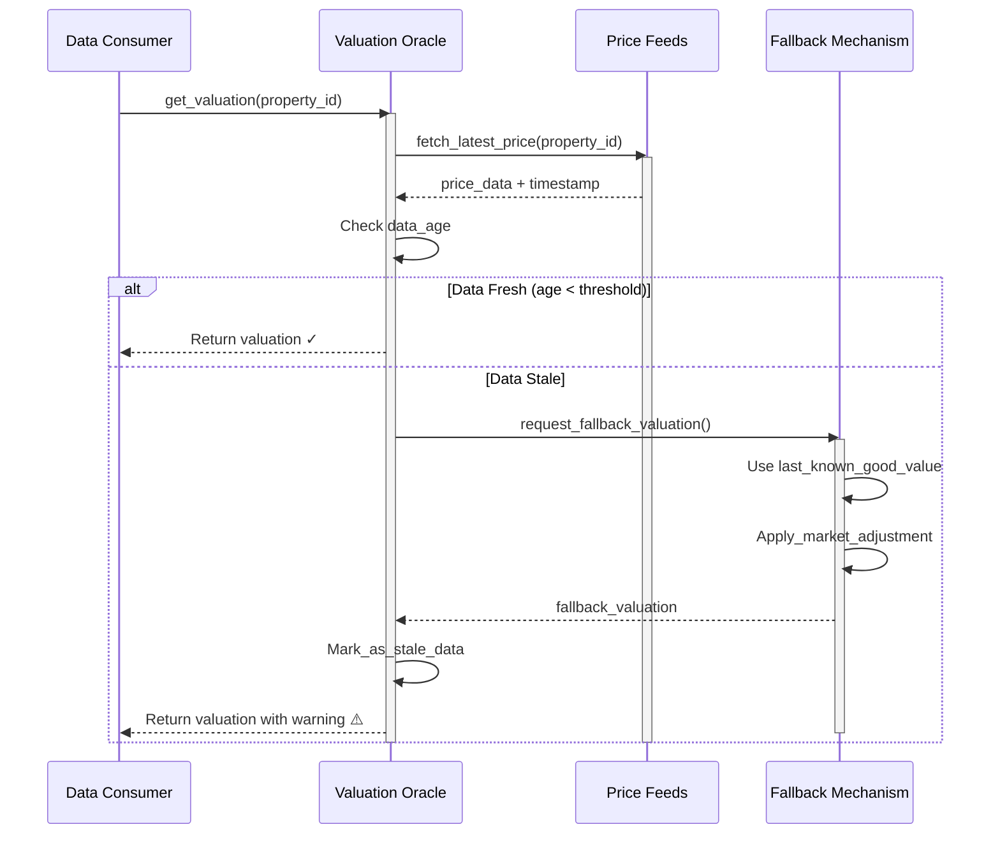
```mermaid
sequenceDiagram
    participant Consumer as Data Consumer
    participant Oracle as Valuation Oracle
    participant Feeds as Price Feeds
    participant Fallback as Fallback Mechanism

    Consumer->>Oracle: get_valuation(property_id)
    activate Oracle
    
    Oracle->>Feeds: fetch_latest_price(property_id)
    activate Feeds
    Feeds-->>Oracle: price_data + timestamp
    
    Oracle->>Oracle: Check data_age
    alt Data Fresh (age < threshold)
        Oracle-->>Consumer: Return valuation ✓
    else Data Stale
        Oracle->>Fallback: request_fallback_valuation()
        activate Fallback
        
        Fallback->>Fallback: Use last_known_good_value
        Fallback->>Fallback: Apply_market_adjustment
        Fallback-->>Oracle: fallback_valuation
        
        Oracle->>Oracle: Mark_as_stale_data
        Oracle-->>Consumer: Return valuation with warning ⚠️
        deactivate Fallback
    end
    
    deactivate Feeds
    deactivate Oracle
```

---

## State Machine Diagrams

### Property Lifecycle State Machine

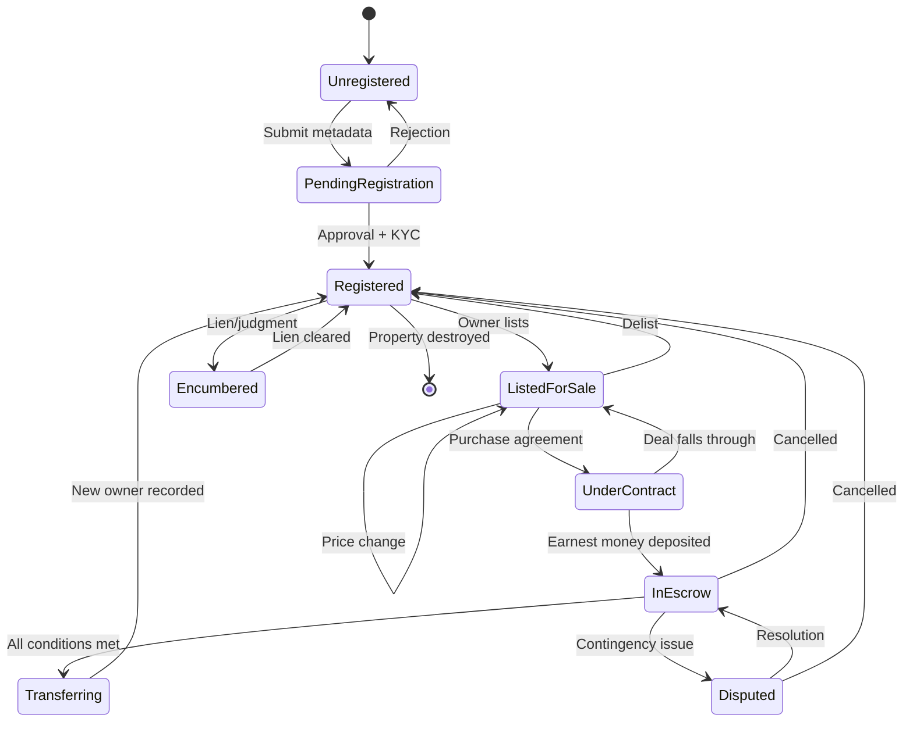
```mermaid
stateDiagram-v2
    [*] --> Unregistered
    Unregistered --> PendingRegistration: Submit metadata
    PendingRegistration --> Registered: Approval + KYC
    PendingRegistration --> Unregistered: Rejection
    
    Registered --> ListedForSale: Owner lists
    Registered --> Encumbered: Lien/judgment
    
    ListedForSale --> UnderContract: Purchase agreement
    ListedForSale --> ListedForSale: Price change
    ListedForSale --> Registered: Delist
    
    UnderContract --> InEscrow: Earnest money deposited
    UnderContract --> ListedForSale: Deal falls through
    
    InEscrow --> Transferring: All conditions met
    InEscrow --> Disputed: Contingency issue
    InEscrow --> Registered: Cancelled
    
    Transferring --> Registered: New owner recorded
    Disputed --> InEscrow: Resolution
    Disputed --> Registered: Cancelled
    
    Encumbered --> Registered: Lien cleared
    Registered --> [*]: Property destroyed
```

### Escrow State Machine

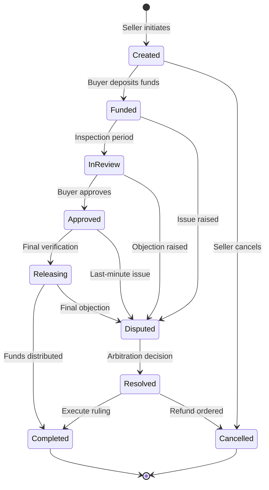
```mermaid
stateDiagram-v2
    [*] --> Created: Seller initiates
    Created --> Funded: Buyer deposits funds
    Created --> Cancelled: Seller cancels
    
    Funded --> InReview: Inspection period
    Funded --> Disputed: Issue raised
    
    InReview --> Approved: Buyer approves
    InReview --> Disputed: Objection raised
    
    Approved --> Releasing: Final verification
    Approved --> Disputed: Last-minute issue
    
    Releasing --> Completed: Funds distributed
    Releasing --> Disputed: Final objection
    
    Disputed --> Resolved: Arbitration decision
    Resolved --> Completed: Execute ruling
    Resolved --> Cancelled: Refund ordered
    
    Completed --> [*]
    Cancelled --> [*]
```

### Compliance Status State Machine

```mermaid
stateDiagram-v2
    [*] --> Unverified: New user
    
    Unverified --> PendingKYC: Documents submitted
    Unverified --> Rejected: Initial screening fail
    
    PendingKYC --> Verified: KYC approved
    PendingKYC --> Rejected: KYC failed
    PendingKYC --> EnhancedReview: High risk
    
    EnhancedReview --> Verified: Enhanced DD passed
    EnhancedReview --> Rejected: Enhanced DD failed
    
    Verified --> Expired: Time expiry
    Verified --> Suspended: Compliance concern
    
    Suspended --> Verified: Issue resolved
    Suspended --> Revoked: Serious violation
    
    Revoked --> [*]
    Expired --> PendingKYC: Re-verification
    Verified --> [*]
    Rejected --> [*]
```

---

## Deployment Sequence Diagrams

### Contract Deployment Pipeline

```mermaid
sequenceDiagram
    participant Dev as Developer
    participant Local as Local Network
    participant Testnet as Test Network
    participant Audit as Security Audit
    participant Mainnet as Production

    Dev->>Local: Deploy contracts
    Local->>Local: Run unit_tests
    Local-->>Dev: Local deployment success
    
    Dev->>Testnet: Deploy to testnet
    Testnet->>Testnet: Integration tests
    Testnet-->>Dev: Testnet validation ✓
    
    Dev->>Audit: Submit for audit
    Audit->>Audit: Security_review
    Audit-->>Dev: Audit report + fixes
    
    Dev->>Dev: Implement audit_recommendations
    
    Dev->>Mainnet: Deploy production
    Mainnet->>Mainnet: Final verification
    Mainnet-->>Dev: Production live ✓
```

---

## Conclusion

These diagrams illustrate the complex interactions between PropChain components across various operational scenarios. Understanding these flows is crucial for:

- **Developers**: Implementing new features correctly
- **Auditors**: Identifying potential security issues
- **Operators**: Managing system operations
- **Users**: Understanding system behavior

For more details on specific contract interactions, see:
- [System Architecture Overview](./SYSTEM_ARCHITECTURE_OVERVIEW.md)
- [Contract API Documentation](./contracts.md)
- [Integration Guide](./integration.md)
